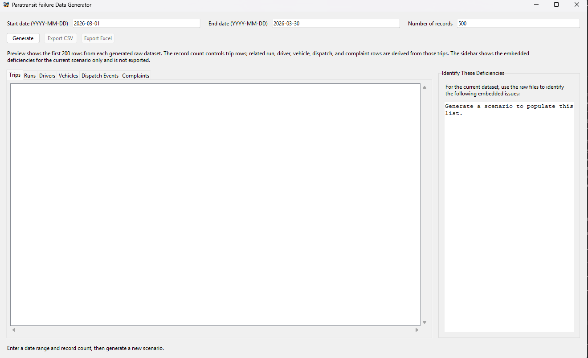
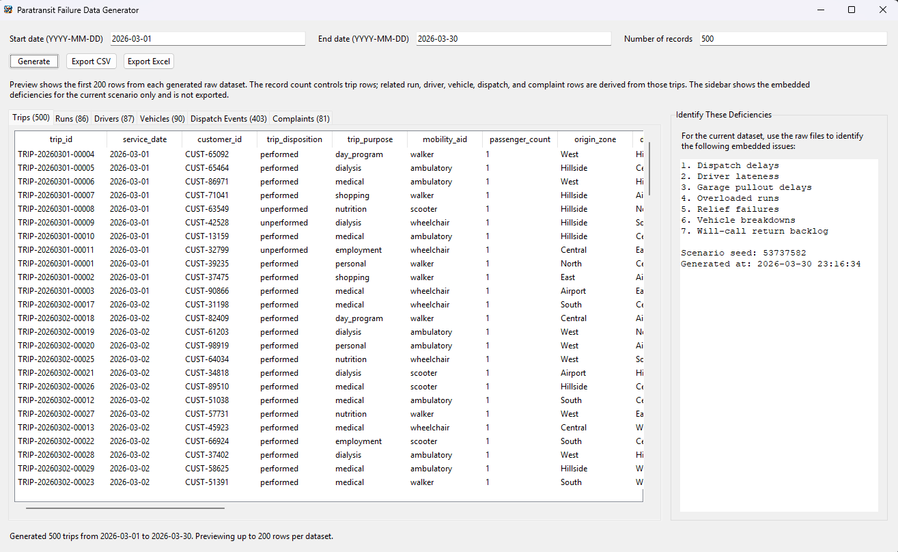
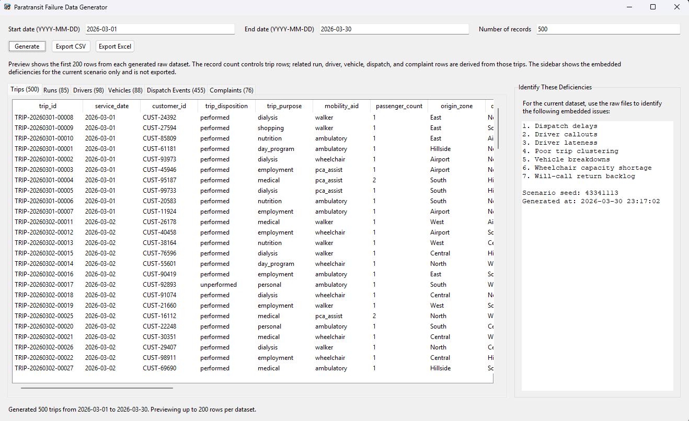

# Paratransit Failure Data Generator

Windows desktop app for generating synthetic row-level paratransit operating data with believable failure scenarios. Each generation automatically mixes a different set of hidden operational problems so you can analyze the raw data later without manually choosing issue types.

The exported files are intended to resemble raw operating records, not a scored or pre-analyzed performance package. The generator uses hidden failure logic internally, but it avoids exporting fields that already label trips as late or runs as overtime for you.

## Screenshots

### Main Screen



### Example Scenario View 1



### Example Scenario View 2



Generated datasets:

- trips
- runs
- drivers
- vehicles
- dispatch events
- complaints

The generator internally varies root causes such as overloaded runs, poor clustering, unrealistic schedules, driver callouts, driver lateness, vehicle breakdowns, dispatch delays, zone-specific pressure, dialysis trip banks, will-call return backlog, wheelchair capacity shortages, same-day add-ons, garage pullout delays, and relief failures. Those issues then cascade into downstream effects like late pickups, missed trips, uncovered service, excessive ride times, overtime, and complaint spikes.

## Features

- Simple GUI with only three inputs: start date, end date, and number of records
- Different hidden failure mix on every generation
- Preview tabs for each raw dataset
- Sidebar that lists the embedded deficiencies for the current scenario
- Export one CSV per dataset
- Export one Excel workbook with a sheet per dataset
- Modular Python code using `pandas` and `Tkinter`

## How It Works

1. Choose a start date.
2. Choose an end date.
3. Enter how many trip records to generate.
4. Generate a scenario.
5. Review the raw trips, runs, drivers, vehicles, dispatch events, and complaints.
6. Use the sidebar list as the scenario answer key while doing your own analysis.

## Record Count

The `number of records` input controls the number of trip rows in the `trips` dataset. The other datasets are derived from those trips, so their row counts vary based on the generated operating conditions.

## Output Style

- The files are meant to look like raw operational extracts.
- The app does not export pre-scored lateness, overtime, or summary performance conclusions.
- The hidden issue mix changes every time you generate a new scenario.
- The GUI can show the embedded deficiencies for that scenario, but those hints are not exported with the data.

## Setup

```bash
pip install -r requirements.txt
```

## Run

```bash
python app.py
```

## Project Structure

```text
app.py
paratransit_generator/
  __init__.py
  exporter.py
  generator.py
  gui.py
  models.py
  scenario.py
requirements.txt
README.md
```

## Notes

- The app is a synthetic raw data generator only.
- It is not a dispatching tool.
- It is not an analytics dashboard.
- Preview is intentionally limited to the first 200 rows per dataset.
